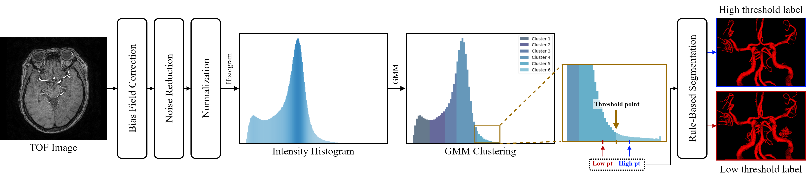
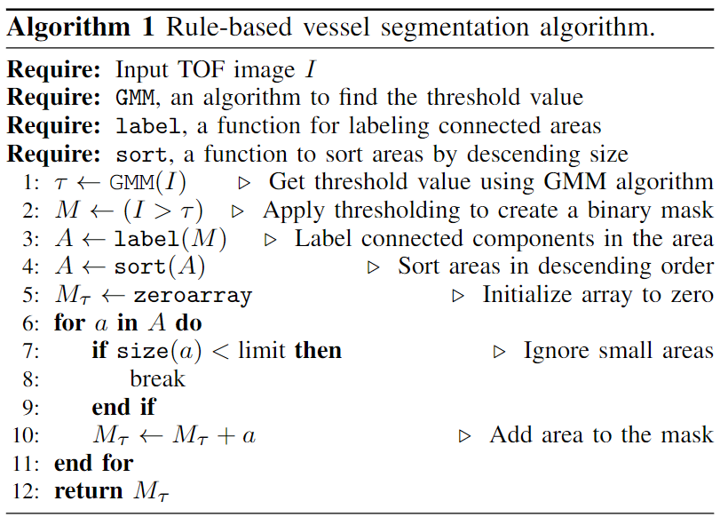

# Label Generator


## Algorithm Pipeline



## Pseudo Code




## Requirement

**ANTs** 

```shell
sudo apt-get update -y
sudo apt-get install git g++ build-essential
bash antsinstallExample.sh

export PATH=./install/bin/:$PATH
```


**Requirement**

```Shell
pip install -r requirement.txt
```


## Run

Run algorithm

```shell
bash run.sh
```


Input directory

```
$/input/
├── 0001_TOF
│   ├── 0001_TOF_3D.nii.gz
│   ├── ...
├── 0002_TOF
│   ├── 0002_TOF_3D.nii.gz
│   ├── ...
├── ...
```


output directory

```
$/oupput/
├── 0001_TOF
│   ├── corrected.nii.gz		// Bias Filed correction image
│   ├── denoised.nii.gz			// Noise Reduction image
│   ├── normalized.nii.gz		// Intensity Normalization image
│   ├── labels
│   │   ├── th.nii.gz			// vessel mask generated with threshold value via GMM
│   │   ├── high_th.nii.gz		// vessel mask generated with high threshold
│   │   ├── low_th.nii.gz		// vessel mask generated with Low threshold 
│   │   ├── mass.nii.gz			
├── 0002_TOF
│   ├── BiasField.nii.gz
│   ├── ...
├── ...
```
