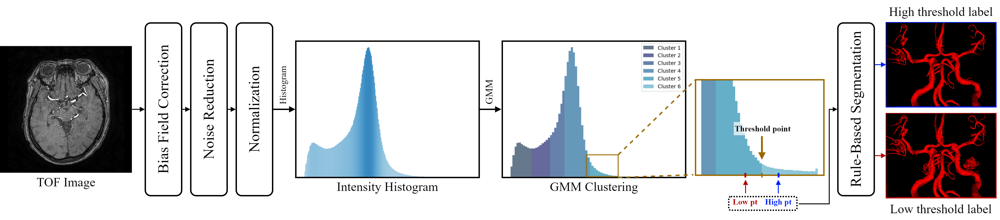
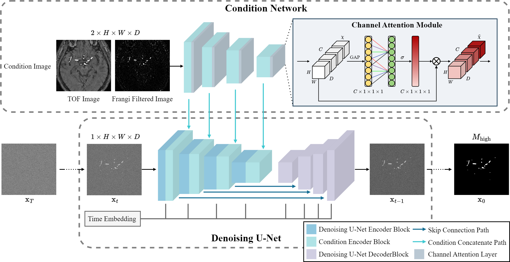

# Enhancing Intracranial Vessel Segmentation using Diffusion Models without Label for 3D Time-of-Flight Magnetic Resonance Angiography

## Overview

This repository contains the code for Enhancing Intracranial Vessel Segmentation using Diffusion Models without Label for 3D Time-of-Flight Magnetic Resonance Angiography. The pipeline to find the threshold value and then get the threshold label is shown in the figure below:

Afterward, the diffusion model below can be trained and inferred using the threshold label.

